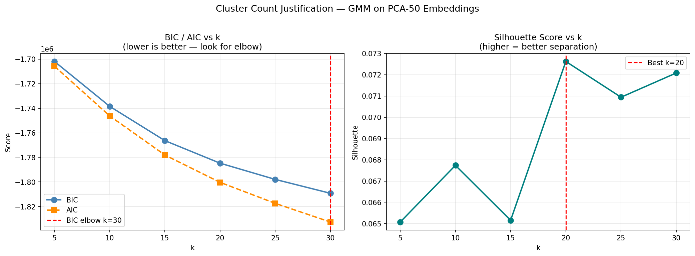
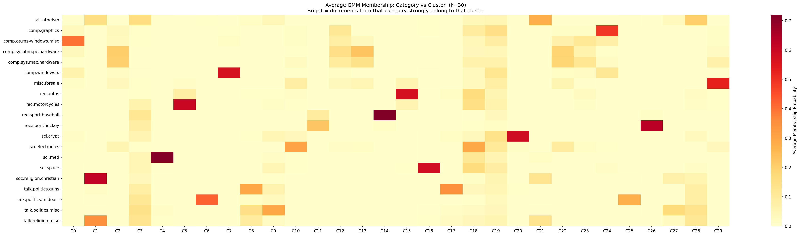
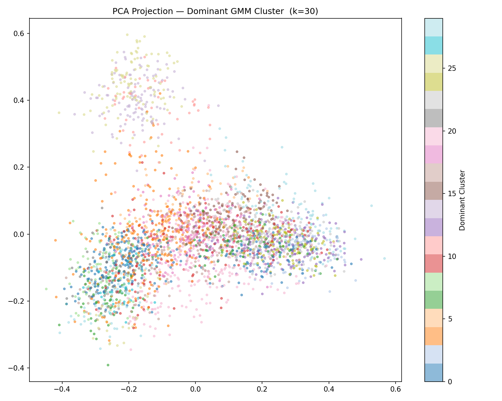
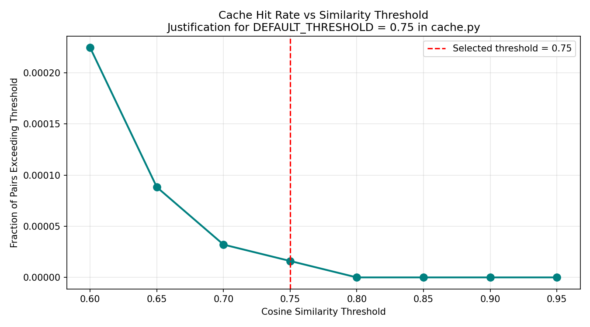

# Semantic Search System — 20 Newsgroups

A semantic search engine over the 20 Newsgroups corpus (~18,000 documents). Unlike keyword search, the system retrieves documents by meaning — the query "NASA rocket launch mission" returns the same results as "space shuttle orbit" because both express the same intent.

The system is built in four stages: text cleaning, dense vector embedding, soft clustering, and a FastAPI search service with a cluster-aware semantic cache. All components run locally with no external infrastructure.

Full design reasoning and evidence are in [`analysis/justification.md`](analysis/justification.md).

---

## Project Structure

```
semantic-search/
├── src/
│   ├── data_cleaning.py     Step 1 — cleans raw corpus, saves CSV
│   ├── embeddings.py        Step 2 — embeds documents, populates ChromaDB
│   ├── clustering.py        Step 3 — PCA reduction + GMM soft clustering
│   ├── cache.py             Cluster-aware semantic cache (imported by api.py)
│   └── api.py               Step 4 — FastAPI search service
├── analysis/
│   ├── justification.py     Cluster count + threshold experiments (run before Step 3)
│   ├── justification.md     Design decisions and evidence
│   └── plots/               Generated plots — committed to git as evidence
├── data/
│   └── samples/             Small data samples — committed to git
├── Dockerfile
├── docker-compose.yml
├── requirements.txt
├── Makefile
└── .gitignore
```

---

## Quickstart — Docker (recommended)

The entire pipeline runs inside the container at build time. No local Python setup required.

**Requirements:** [Docker Desktop](https://www.docker.com/products/docker-desktop/) installed and running.

```bash
git clone <repo-url>
cd semantic-search
docker compose up --build
```

The first build takes 5–10 minutes — it cleans the corpus, generates embeddings for 16,768 documents, and runs clustering, all inside Docker. Subsequent starts are instant since the image is cached.

Open **http://localhost:8000/docs** to access the API.

**To stop:**

```bash
docker compose down
```

---

## Local Installation

```bash
python3 -m venv venv
source venv/bin/activate
pip install -r requirements.txt
```

**Dependencies:**

| Package                 | Purpose                              |
| ----------------------- | ------------------------------------ |
| `scikit-learn`          | PCA, GMM, silhouette scoring         |
| `sentence-transformers` | Embedding model (`all-MiniLM-L6-v2`) |
| `chromadb`              | Persistent vector database           |
| `fastapi` + `uvicorn`   | API server                           |
| `joblib`                | PCA model persistence                |
| `pandas`, `numpy`       | Data handling                        |
| `matplotlib`, `seaborn` | Justification plots                  |

---

## Running the Pipeline Locally

All commands must be run from the project root (`semantic-search/`).

### Step 1 — Clean the corpus

```bash
python3 src/data_cleaning.py
```

Loads the 20 Newsgroups dataset, strips metadata headers, quoted reply lines, email addresses, and URLs. Drops documents under 20 words. Saves ~16,700 cleaned documents to `data/cleaned_newsgroups.csv`.

### Step 2 — Generate embeddings

```bash
python3 src/embeddings.py
```

Encodes every document into a 384-dimensional vector using `all-MiniLM-L6-v2`. Stores vectors and metadata in a persistent ChromaDB collection. Also saves the raw matrix to `data/embeddings_matrix.npy` for use by the clustering step. Takes approximately 90 seconds on Apple Silicon (MPS).

### Step 3 — Determine cluster count

```bash
python3 analysis/justification.py
```

Fits Gaussian Mixture Models for k ∈ {5, 10, 15, 20, 25, 30} on PCA-reduced embeddings. Prints a recommended k value based on BIC elbow and Silhouette score. Saves all evidence plots to `analysis/plots/`.

After running, open `src/clustering.py` and set `BEST_K` to the recommended value.

### Step 4 — Run clustering

```bash
python3 src/clustering.py
```

Applies PCA (384 → 50 dimensions) then fits GMM with the chosen k. Each document receives a probability distribution across all clusters rather than a single hard label. Saves `data/cluster_memberships.npy`, `data/cluster_centers.npy`, and `data/pca_model.joblib`.

### Step 5 — Start the API

```bash
uvicorn src.api:app --reload
```

Open **http://localhost:8000/docs** for the interactive Swagger UI.

---

## API

| Method   | Endpoint       | Description                               |
| -------- | -------------- | ----------------------------------------- |
| `POST`   | `/query`       | Semantic search with cache lookup         |
| `GET`    | `/cache/stats` | Hit rate, miss count, entries per cluster |
| `DELETE` | `/cache`       | Flush cache and reset statistics          |
| `GET`    | `/health`      | Readiness check                           |

### Cache miss — first query

```bash
curl -X POST http://localhost:8000/query \
  -H "Content-Type: application/json" \
  -d '{"query": "space shuttle NASA orbit"}'
```

```json
{
  "query": "space shuttle NASA orbit",
  "cache_hit": false,
  "matched_query": null,
  "similarity_score": null,
  "dominant_cluster": 9,
  "result": [{ "text": "...", "category": "sci.space", "similarity": 0.527 }]
}
```

### Cache hit — paraphrase of previous query

```bash
curl -X POST http://localhost:8000/query \
  -H "Content-Type: application/json" \
  -d '{"query": "NASA rocket launch mission"}'
```

```json
{
  "query": "NASA rocket launch mission",
  "cache_hit": true,
  "matched_query": "space shuttle NASA orbit",
  "similarity_score": 0.81,
  "dominant_cluster": 9,
  "result": [...]
}
```

Different words, same meaning — the cache returns the stored result without recomputation.

---

## How It Works

### 1. Embedding

Each document is encoded into a 384-dimensional vector by `all-MiniLM-L6-v2`, a sentence-transformers model fine-tuned for semantic similarity. This produces one vector per document — capturing meaning, not just keywords. The model runs entirely locally with no API calls.

### 2. Vector store

ChromaDB stores all document vectors alongside their category metadata. At query time it performs approximate nearest-neighbour search in cosine space, returning the top 5 most semantically similar documents.

### 3. Soft clustering

Documents are clustered using a Gaussian Mixture Model (GMM) rather than KMeans. The key difference: GMM assigns every document a probability distribution across all clusters rather than a single hard label.

```
"Senate votes on NASA funding"
  KMeans → politics              (forced single label, loses information)
  GMM    → {politics: 0.55, space: 0.38, other: 0.07}  (reflects reality)
```

PCA reduces dimensions from 384 to 50 before clustering. In 384 dimensions all pairwise distances become nearly identical (curse of dimensionality), preventing the algorithm from finding meaningful boundaries. The fitted PCA model is saved to disk so incoming queries can be projected into the same space at runtime.

### 4. Semantic cache

The cache stores query embeddings rather than query strings. On each incoming request:

1. The query is embedded into a 384-dim vector.
2. The vector is projected to 50-dim PCA space and assigned to the nearest GMM cluster.
3. The cache searches only within that cluster bucket — O(n/k) instead of O(n).
4. If any stored embedding has cosine similarity ≥ 0.75 with the incoming query, the stored result is returned immediately.

At k=20 this gives approximately 20× fewer comparisons per lookup as the cache grows.

---

## Justification Evidence

All plots are generated by `python3 analysis/justification.py` and committed to `analysis/plots/`. Full reasoning is in [`analysis/justification.md`](analysis/justification.md).

### Cluster count — BIC elbow and Silhouette



BIC and Silhouette scores across k values. The elbow in the BIC curve and the Silhouette peak together identify the optimal cluster count.

### Semantic coherence — category heatmap



Average GMM membership per original newsgroup category per cluster. Clusters that light up for semantically related categories (e.g. `sci.space` and `sci.astro`) confirm the model discovered meaningful topic structure rather than arbitrary partitions.

### Cluster separation — PCA projection



Documents projected to 2D and coloured by dominant cluster. Distinct colour regions confirm clusters occupy separate areas of the embedding space.

### Soft assignments — boundary cases

The 10 highest-entropy documents are saved to `analysis/plots/boundary_cases.txt`. These are documents whose membership is genuinely spread across multiple clusters — the strongest evidence that soft clustering is preferable to hard clustering.

```
category: talk.politics.guns   entropy: 2.41
  cluster_N (politics): 0.44
  cluster_M (firearms): 0.39
```

### Cache threshold



Hit rate across cosine similarity thresholds on a random corpus subsample. The threshold of 0.75 is selected at the point where genuine paraphrases are captured while semantically distinct queries are correctly treated as misses.

---

## Runtime Files (gitignored)

These files are generated by the pipeline and excluded from version control. Docker rebuilds them automatically. For local runs, re-run the pipeline steps above.

| File                           | Generated by       | Used by                             |
| ------------------------------ | ------------------ | ----------------------------------- |
| `data/cleaned_newsgroups.csv`  | `data_cleaning.py` | `embeddings.py`                     |
| `data/embeddings_matrix.npy`   | `embeddings.py`    | `clustering.py`, `justification.py` |
| `data/chroma_db/`              | `embeddings.py`    | `api.py`                            |
| `data/cluster_memberships.npy` | `clustering.py`    | `api.py`                            |
| `data/cluster_centers.npy`     | `clustering.py`    | `api.py` → `cache.py`               |
| `data/pca_model.joblib`        | `clustering.py`    | `api.py` → `cache.py`               |
